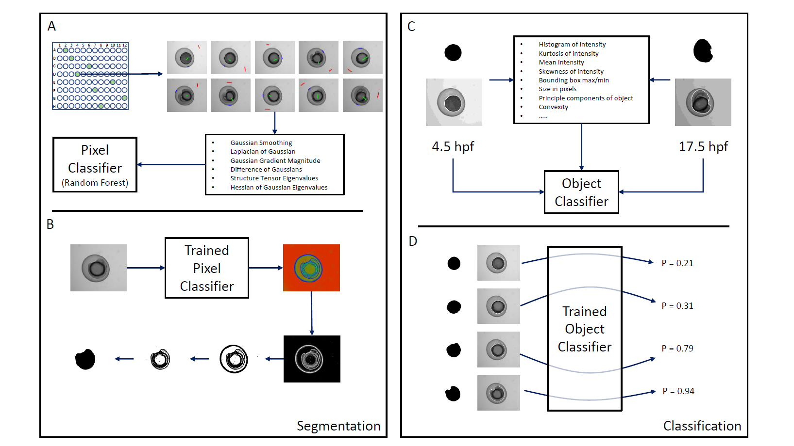

[](https://zenodo.org/badge/latestdoi/528398305) 


# Fish Quant

Jones RA, Renshaw MJ, Barry DJ and Smith JC. Automated staging of zebrafish embryos using machine learning. Wellcome Open Res 2022, 7:275 (https://doi.org/10.12688/wellcomeopenres.18313.1)



## Necessary Software

In order to analyse images using these scripts, you will need both [FIJI](https://fiji.sc/) and [ilastik](https://www.ilastik.org/), both open source and freely available. To analyse the resultant data, we suggest [RStudio](https://www.rstudio.com/), using the .R scripts in this repo.

## Input

It is expected that the input will consist of a TIFF file, containing multiple timepoints. We suggest using [Bio-Formats](https://www.openmicroscopy.org/bio-formats/) to convert your files if necessary.

## Running the scripts

The following steps take raw image input and convert it into tabular results that can be analysed using R. While it is possible to run everything step-by-step from within ilastik and FIJI, it is quicker and easier to run everything from the command line. This also facilitates automation.

All of the following steps are written for Mac/Linux. For windows users, simply use Command Line instead of Terminal and replace any occurance of `run_ilastik.sh` with `run_ilastik.bat` and any occurance of `ImageJ-linux64` with `ImageJ-win64.exe`.

### Step 1 - Run the ilastik pixel classifier

Assuming the name of your input file is `input.tiff`, open a terminal and run the following command:

```
<Path to ilastik installation>/run_ilastik.sh --headless --project="./Ilastik_Projects/PixelClassifier.ilp" --export_source="Probabilities" --export_dtype="uint16" --pipeline_result_drange="(0.0,1.0)" --export_drange="(0,65535)" --output_format="multipage tiff" --output_filename_format="<Path to output folder>/{nickname}_{result_type}.tiff" "input.tiff"
```
### Step 2 - Segment the probability maps with FIJI

```
<Path to FIJI Installation>/ImageJ-linux64 --headless --console -macro "FIJI_Scripts/Segment.ijm" "<Output from Step 1>.tiff,<Path to output from Step 1>,<Path to output folder>,<Maximum number of timepoints in all datasets being analysed>"
```
### Step 3 - Run the ilastik object classifier

For this step, you will again need the input to Step 1 (`input.tiff`).

```
<Path to ilastik installation>/run_ilastik.sh --headless --project="./Ilastik_Projects/ObjectClassifier.ilp" --export_source="Object Probabilities" --output_format="multipage tiff"  --output_filename_format="<Path to output>/{nickname}_{result_type}.tiff" --raw_data="input.tiff" --segmentation_image="<Path to output from Step 2>" --export_dtype="float32" --readonly="true"
```

### Step 4 - Tabulate the results of the object classifier using FIJI

```
<Path to FIJI Installation>/ImageJ-linux64 --headless --console -macro "./FIJI_Scripts/fiji_object_analysis.ijm" "<Path to output from Step 3>"
```
